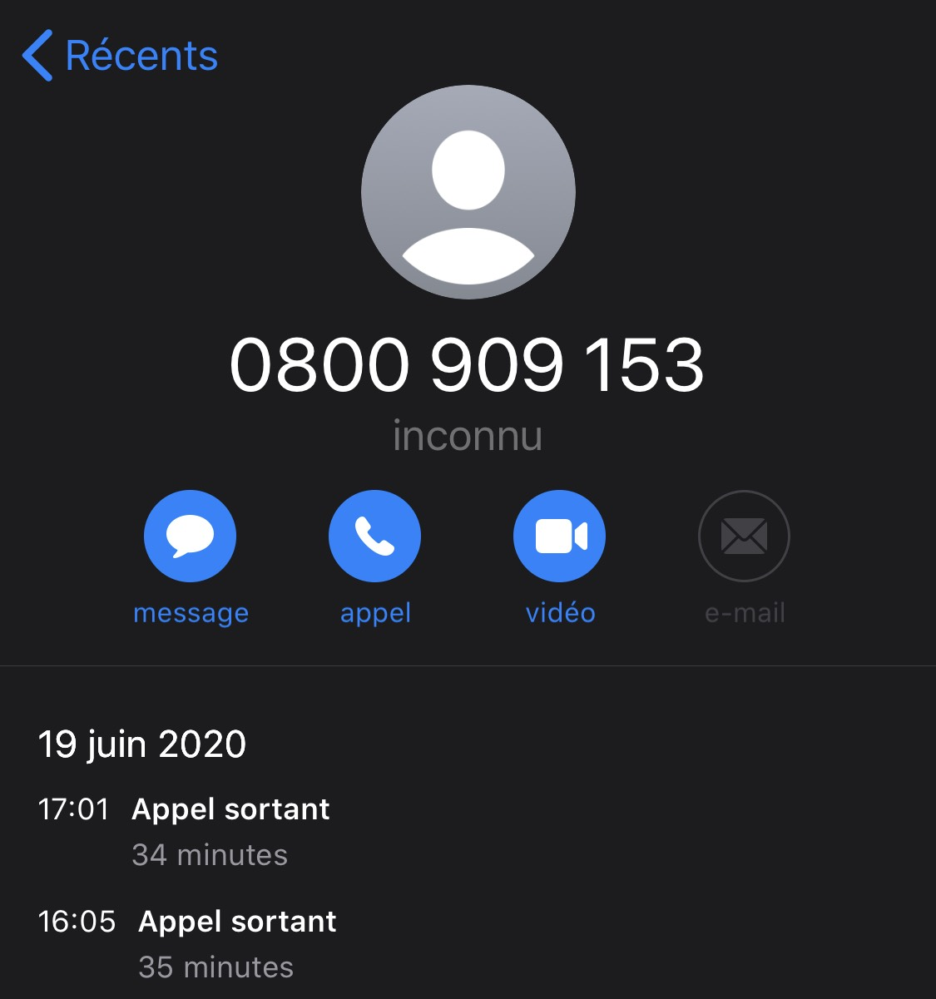

# 👩‍🎓👨‍🎓Online proctored exam for AWS certification

I went through an online AWS certification exam instead of a test center. Here is my experience 👇

<!-- more -->

## Getting certified

I have been working - hands on - in an AWS cloud environment since 2017. I learned a lot since then, and it was time to get certified. [AWS Certified Solutions Architect - Associate](https://aws.amazon.com/certification/certified-solutions-architect-associate/) looked like the best fit for me to get started.

Both a challenge and also a way to make sure I was not missing obvious notions or services I should have known when designing architectures.

To get certified, you have to pass a test and get a score above 72%. The test is made of 65 questions, lasts 2 hours and 10 minutes but can be extended if you need (and are granted) special accomodations.

As an example (and this is a common use case), I got 30 minutes extra as English is my second language. Make sure to request it prior scheduling if that is your case. I used this time to review all the answers I wasn't 100% sure.

See all the details on the [AWS certification page](https://aws.amazon.com/certification/certified-solutions-architect-associate/).

## Preparing

There are many resources available to prepare for this exam. This is not the purpose of this article, but for completness, I used:

* [Stephane Marek's course on Udemy](https://links.datacumulus.com/aws-certified-sa-associate-coupon) to get through all the concepts
* [Stephane Marek's practice tests](https://links.datacumulus.com/aws-cert-solution-architect-pt-coupon)
* [Jon Bonso's practice tests](https://www.udemy.com/course/aws-certified-solutions-architect-associate-amazon-practice-exams-saa-c02/) - from its [AWS Certified SAA C02 study guide](https://tutorialsdojo.com/aws-certified-solutions-architect-associate-saa-c02/)

This ☝, plus the AWS white papers ([AWS Well-architected framework and the five pillars](https://aws.amazon.com/architecture/well-architected)) were enough for me to pass the exam.

## Online or test center

To pass the exam, you have the choice between a test center or online. As the nearest test center is one hour drive from home (office), and because I care for my time and my footprint on earth 🌍, I was keen to avoid a train 🚅 or car 🚗 roundtrip to the test center.

Online was definitely the way to go. AWS has two partners for testing: PSI and Pearson VUE. At the time of writing, Pearson VUE is the only one to offer an online test, in addition to physical test centers.

So, I went with an **online test with Pearson VUE**.

## Scheduling

Scheduling can be done online. That is most certainly the easiest way. But I could not use this option: when you have a special accomodation (even something trivial such as ESL / **E**nglish as **S**econd **L**anguage), the test must be scheduled by phone.

...And I have to say that scheduling by phone was a very sub-par experience for me. Here is how it went:

* Get the (toll free) phone number as I learned that I had to do this by phone
* Call the number
* Go through a lot of options "screens" (press 1, 2, 3 or 9 for other options) which have nothing to do with AWS
* As none of the option were applicable, I waited long minutes to finally get someone on the phone
* Spell my name, address, name of the parents, date of birth, ...
* Provide my AWS candidate ID. 💡 Tip: You can find it at the top right of this page [www.certmetrics.com/amazon/default.aspx](https://www.certmetrics.com/amazon/default.aspx). It starts with AWS then numbers.
* Finally! Getting to the payment. I was put on hold to process the payment, but the person on the phone could not hear me anymore after that. He was nice and polite, but ended up hanging up on me as he could not hear me anymore.

So, here I go, calling the number again. No trace of my call apparently - so I had to do it all over again.

Overall, I spent an hour and 10 minutes on the phone to schedule the exam. I surely hope the next time will be easier!

## Re-scheduling

Once you have scheduled the exam, it is possible to re-schedule it, as long as you do so 24 hours in advance. Because of a personal emergency, I had to re-schedule mine (25 hours before the original time!). Re-scheduling was all online and easy.

## Preparing your space

The online exam itself is explained on the [Pearson VUE page](https://home.pearsonvue.com/Test-takers/OnVUE-online-proctoring.aspx). It is called "OnVUE".

I will let you check their FAQ and other pre-requisites as this will certainly evolve over time. There is a 📺 video which explains how this all works.

<iframe allow="autoplay; fullscreen" allowfullscreen="" class="embed-responsive-item" frameborder="0" height="360" id="video2" src="https://player.vimeo.com/video/419955598?byline=0&amp;title=0" title="OnVUE Testing Experience" width="640"></iframe>

 

Here are few things I had to go through myself to prepare my home office:

* Removed my second monitor. I ended up having only my laptop on my desk, and my bluetooth mouse
* Removed all clutter: papers, glass of water: you cannot drink nor have a snack during the exam
* No paper, no pen (I like drawing to understand the questions better!). However, there is a way to add notes to each question. I used that. That helped when reviewing the answers at the end which I was not quite sure about
* Two things to keep handy for the time of the test:
  * Your phone to go through the check-in process (I had mine on plane mode in another room)
  * Your government issued ID.

## Check-in process

The check-in happens PRIOR the actual exam, just after clicking the "Begin Exam" and before taking the actual exam. Here are the steps:

* System Check: a small test is executed to check that your webcam, your microphone and your internet all work as expected. This is done on your PC/MAC.
* Your picture: take a picture of yourself on a solid background. This is done with a mobile web site (or your PC/MAC + Webcam)
* Photo identification: take a picture of the government issued ID - I used my passport
* Workspace verification: take several pictures of the workspace / home office / room
* Close all applications

Few notes:

* Check-in early: I was scheduled at 14:00 and could click on the "Begin Exam" button 30 minutes before
* The check-in process is partly self-service (through your PC/MAC and phone), partly with an examinator who will check additional details
* There is a point in the check-in process from which you cannot leave your desk / not being on camera anymore. This is the time to make this last stop to the bathroom 🚻 before 2.5 hours! If I remember well, this last step is when you get the message to "**Close all applications except OnVUE**"
* After some time, the examinator connects. You will have to stay on camera while waiting - it took a good 10 minutes for me
* The examinator asked me to show my hands, wrists, glasses (no Google glasses!) and use my webcam to show the space around the desk, and the desk itself. Plan for some extra wire in case you use a laptop and that it is connected to the internet through a wired connection and plugged in (good idea: you do not want to run out of battery 🔋)
* You will be monitored during the testing session in real time so that your face, voice, desk and workspace will be captured and possibly recorded during the testing session
* ⚠ Make sure nobody enters the room, visible or not, is overheard or detected. This will terminate and void the test!

## The exam

Sorry, I can't share anything about the actual questions as this is all under NDA, and frankly would ruin the whole purpose of the certification. But check the ["preparing"](#preparing) section to be well prepared.

Some notes:

* Put your phone away from arms length, but do not power it off! Pearson VUE may want to reach you in case of an issue during the test (mine was in plane mode, too far to reach once the webcam monitoring was on - so I left it this way).
* You can mark questions for later review
* You can add notes to questions - this is handy for reviewing questions later and having some notes
* At the end of the 65 questions, you go through a review step where you will be able to review all questions, questions you marked for later review, or questions you skipped
* For multi choice answers, you cannot check 3 check boxes when only 2 can be checked. If you do, you will get an alert.
* You can chat with the examinator (I did not)
* There is a survey at the end to share how the test went

Alright, that's all folks! Let me wish you...

## Good luck! 🍀🤞
