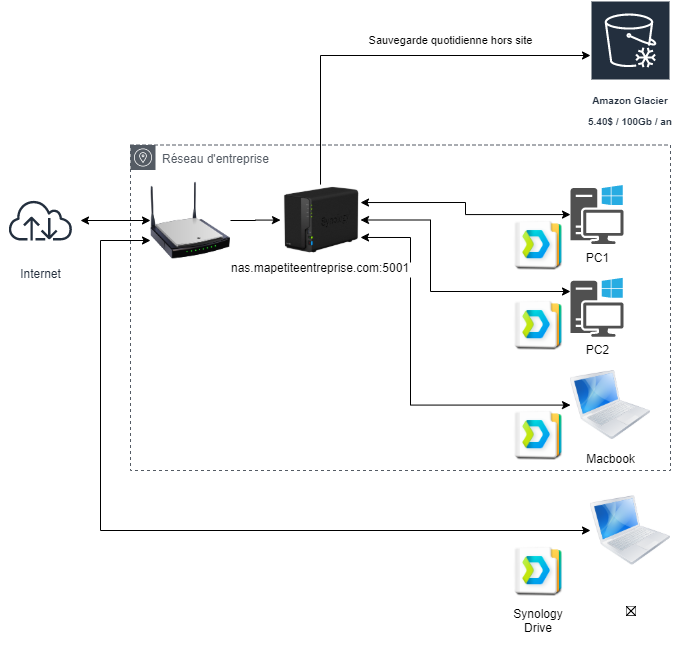
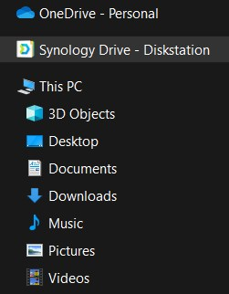

# Synology NAS pour une startup / Micro entrepreneur / PME

Un exemple de mise en place d'un NAS pour une micro entreprise

<!-- more -->

J'ai récemment eu l'occasion de mettre en place un NAS Synology pour une micro-entreprise de ma famille.

Je partage ici les fonctionnalités mises en oeuvre, sans fournir un tutoriel pas à pas.

## Matériel

[DS218+](https://www.synology.com/fr-fr/products/DS218/) - NAS à 2 baies, avec 2 disques de 3 TB en mode [SHR](https://www.synology.com/fr-fr/knowledgebase/DSM/tutorial/Storage/What_is_Synology_Hybrid_RAID_SHR), pour une capacité totale utile de 2,72 TB.

## Architecture

## Fonctionnalités

Application [Synology Drive](https://www.synology.com/fr-fr/dsm/feature/drive):

* Sauvegarde en continu des postes de travail : résilience face aux pannes
* Sauvegardes cryptées : protection des données en cas de vol du NAS
* Répertoires partagés entre les postes
* Partage de fichiers ou répertoires via des liens uniques / à durée limitée (comme OneDrive/Dropbox/Box)
* Accès aux fichiers à distance / hors du réseau d'entreprise

Application [Synology Glacier](https://www.synology.com/fr-fr/dsm/packages/GlacierBackup):

* Archive longue durée hors site vers AWS S3 Glacier (coût d'archivage : 5,40$ / 100 Gb / an - coût de récupération : suivant la vitesse demandée - voir [ce site](http://liangzan.net/aws-glacier-calculator/)) : protection en cas d'incendie, vol ou ransomware / crypto virus.

## Services annexes

Application [Moments](https://www.synology.com/fr-fr/dsm/feature/moments):

* Partage de photos
* Création d'albums photos
* Partage d'albums
* Sauvegarde de photos des téléphones automatiques

## Utilisation

### Sur les postes de travail

Chaque poste de travail est installé avec Synology Drive Client, téléchargeable [ici](https://www.synology.com/fr-fr/support/download/DS218+#utilities).

Une fois Synology Drive Client installé, on crée deux tâches : la tâche de sauvegarde et la tâche de synchronisation.

* Tâche de sauvegarde : elle permet de sauvegarder certains dossiers des postes, de façon manuelle, planifiée ou en continu.
* Tâche de synchronisation : expose un disque virtuel, propre à chaque compte utilisateur, permettant de stocker et partager des 
fichiers, y compris avec des partenaires de l'entreprise / en dehors du réseau d'entreprise grâce à des liens permanents ou 
à durée de vie limitée. Permet également d'avoir des dossiers d'équipe partagés.

