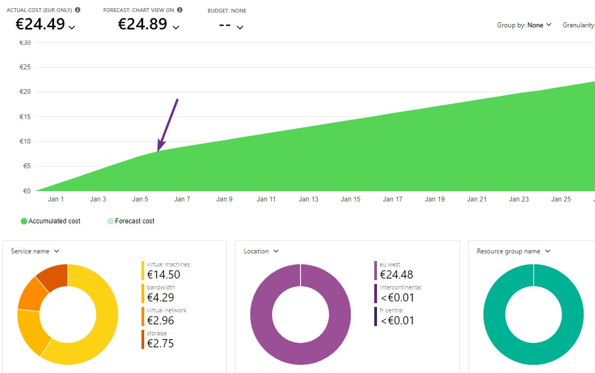
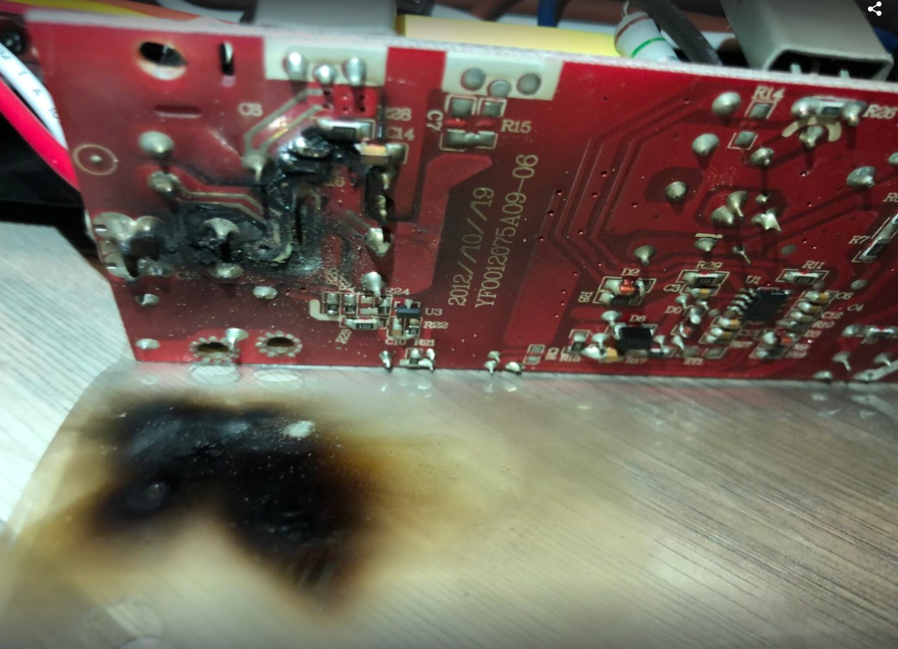

# January 2021

Personal highlights from January 2021

<!-- more -->

Inspired by [Ken Corless](https://www.linkedin.com/in/kencorless/) and [Chris Swan](https://blog.thestateofme.com/) "month in review" posts, here is mine.

👋 2021

## Physical 2021 New Year Wishes

Yes, 2020 was hard. As an optimistic, I like to send wishes. I am not done on "real world" New Year wishes, so I sent my round of wishes to friends and family. Writing "for real" and sending those is a nice way to start the year.

Since then, I got phone calls back or text messages. This was good to reconnect with everyone. A special touch I guess.

## Multiple wordpress sites on one VM

The original cloud provider I use for some of my personal Wordpress web sites - one.com - has drastically raised prices
for its shared infrastructure. I decided to break free and use an Azure subscription I own and also use it as a 
practice ground. This decision is not purely based on cost, as I wanted to also learn few things on nginx reverse proxying and Docker.

I ended up running multiple Wordpress sites on a single VM leveraging Docker. I did not go the "Wordpress Multisite" route for the following reasons:

* Easier move from existing hosting provider: restoring a single site config on a multisite config is rather complex and would prevent to move to other providers if I wanted to
* Found out that there is not much overhead when running multiple WPs and even DB on one VM. At least with my level of traffic

To run multiple sites, with different SSL certificates, each Wordpress site runs its own container and is proxied by an Nginx proxy that handles SSL thanks to LetsEncrypt. This setup relies on [https://github.com/jwilder/nginx-proxy](https://github.com/jwilder/nginx-proxy) and [https://github.com/JrCs/docker-letsencrypt-nginx-proxy-companion](https://github.com/JrCs/docker-letsencrypt-nginx-proxy-companion).

For 3 sites, I use a [Standard B1ms](https://docs.microsoft.com/en-us/azure/virtual-machines/sizes-b-series-burstable) (1 VCPU, 2Gib ram). Very small VM, which is at about 20€ / month in my region. But CPU and mem have been just fine:

Now, a small facepalm 🤦‍♂️ - I had a Prometheus/Grafana monitor which I did setup a while back, running from my Synology NAS. 
The cost of doing that was not visible to me as network cost was embedded in the one.com pricing. But, on Azure, my outbound bandwidth cost went way higher that what I was expecting. It took me some time to figure out that monitoring from outside was causing this. I do not really need outside monitoring, so I turned it off.

The entire setup is in a private GitHub repo I own. A `docker-compose up`, and I am off and running. I may have a look at K8s next for this next.

## Fixing a pinball

Some friends of mine have a beautiful Client Eastwood - Dirty Harry - Pinball.

Flippers and bumpers were not working. And as I am known to fix things, I spent few hours on this baby. I never opened a pinball before: the amount of wires and discrete electronic components threw me back in time when I first fixed my Arcade machine (Mortal Kombat 3).

After getting the PDF of the internal wiring, and testing few options, it turned out to be one fuse to replace. That was good fun, and the pinball is now fully functional.

I have been looking at virtual Pinballs - maybe one day if I have space in the house.

## Fixing Advance DJ light fixture

I use several lights fixtures for the [Shiny Darkness](https://shinydarkness.com/) shows.
One of them - the [ADJ Sweeper Beam Quad Led](https://www.adj.com/sweeper-beam-quad-led) ended up have 4 leds misbehaving. You can see two of them on each side of the stage in this video:

<iframe width="560" height="315" src="https://www.youtube.com/embed/f91hX38PzP0" frameborder="0" allow="accelerometer; autoplay; clipboard-write; encrypted-media; gyroscope; picture-in-picture" allowfullscreen></iframe>

Found out that the power supply died: contacted ADJ support, and I was able to order a replacement part easily.

Fixing stuff feels great!

## Router failure

Like many, I have been working from home since March 2020. Home is wired with CAT6 in all rooms, and I can enjoy gigabit ethernet from the home office.

One Thursday, without any warning sign, network performances degraded badly. The ethernet between the internet provider box and my router would sync at 1 Gb to then go down to 10 Mbps. I initially suspected cabling, but after testing each of the sections, it turned out that my cheap 1Gbps / 8 ports / unmanaged router - albeit working - would just not continue to sync at 1 Gbps.

I ended up ordering a new one, a [NetGear GS108](https://www.netgear.com/support/product/GS108v4) and went back in business within 3 days during which I fell back to WIFI. I still think that there is a weak cabling issue that the new router can handle better than the older one.

This is how I realized that - when working from home - that infrastructure is really important.

## First paraglidier flight in 2021

Took advantage of a good day (for January anyway) to fly my paraglider.

<iframe width="560" height="315" src="https://www.youtube.com/embed/bo_aTiWl_I0" frameborder="0" allow="accelerometer; autoplay; clipboard-write; encrypted-media; gyroscope; picture-in-picture" allowfullscreen></iframe>

The amount of freedom you get in the air is just... Wow.

I edit my videos mostly with [Sony Vegas movie studio](https://www.vegascreativesoftware.com/gb/vegas-movie-studio/). Never crashes, but titling capabilities are really basic.

I used to work with [Magix FastCut](https://www.magix.com/int/support/know-how/tutorial-videos/fastcut/) which was really nice to quickly create videos in 4K, synced to the music and with some creative effects. But it does not work with H265 code which I use more and more.

## Rockonteurs podcast

I love music and I love podcasts - although I have less opportunities to listen to them (no biking commute, very little driving).

Lately, I discovered the Rockonteurs podcast with [Guy Pratt](https://en.wikipedia.org/wiki/Guy_Pratt) (bass, Pink Floyd) and [Gary Kemp](https://en.wikipedia.org/wiki/Gary_Kemp) (two awesome musicians). Both of them are now playing on Nick Mason's (Pink Floyd) "[Saucerful of Secrets](https://en.wikipedia.org/wiki/Nick_Mason%27s_Saucerful_of_Secrets)" project.

Those two are now interviewing music legends. What is nice is getting back stories from many bands I respect: Pink Floyd, Tears for Fears, AC/DC, Boy George, Dave Stewart (Eurythmics), ... The list goes on.

My favorite episode so far is with Brian Johnson (AC/DC). You don't want to miss it - full of info, and sooo funny! 

<iframe src="https://tunein.com/embed/player/t159957927/" style="width:100%; height:100px;" scrolling="no" frameborder="no"></iframe>
