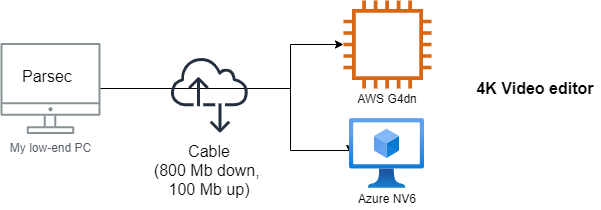

# February 2021

Things I built or fixed in February 2021.

<!-- more -->

Inspired by [Ken Corless](https://www.linkedin.com/in/kencorless/) and [Chris Swan](https://blog.thestateofme.com/) "month in review" posts, here is mine.

## 📺 Video editing GPU PC in the cloud ⛅

To edit 4k videos, I sometimes need a powerful GPU. I wanted to get one of those NVidia RTX 3060 TI (~ 450€), but there is a big semiconductors shortage, which may last [until 2022 according to analysts](https://www.marketwatch.com/story/worldwide-chip-shortage-expected-to-last-into-next-year-and-thats-good-news-for-semiconductor-stocks-11614020156). 
Plus, I will have to probably upgrade the motherboard, CPU, RAM and power supply. Not fun 😣.

Time to try something I have been contemplating for a while: get my video rig to the cloud! AWS offers [G4 EC2 instances](https://aws.amazon.com/ec2/instance-types/g4/) equipped with NVidia or AMD GPUs, and Azure has its [NV series](https://docs.microsoft.com/en-us/azure/virtual-machines/nv-series), powered by NVidia Tesla M60.

I have tried both, and ended up keeping the AWS one. Apparently Azure was short of NV6 with GPUs in my region (France), which prevented to raise account restrictions despite several tickets.

To optimize costs, I use [AWS spot instances](https://aws.amazon.com/ec2/spot/), terminate the VM on shutdown, snapshot the [EBS](https://aws.amazon.com/ebs/) storage with a [Lambda](https://aws.amazon.com/lambda) function triggered by a [cloudwatch](https://aws.amazon.com/cloudwatch/) event and create an AMI out of it.
Starting the VM amounts to double-click on a script which starts it from a launch template.

To get very fast response time with video and audio, I do not use the standard remote desktop solution, but [PARSEC](https://parsec.app/), which is also used for gaming rigs. And that went beyond my expectations: the response time has been great (I do have cable at home though) and very usable for video editing.

🤫 I could not resist and installed a few games on it. Project Cars 2 is working great, and I can even plug my Thrusmaster racing wheel thanks to [VirtualHere](https://virtualhere.com/) which expose local USB devices to a remote system. So, I now can use the VM for both video AND occasional gaming (I doubt VR...).

What about cost? I have been using `g4dn.xlarge` EC2 spot instances (4 vCPUs, 16 GB RAM), with a 300 Gb EBS storage. The 300 Gb EBS costs me $0.39/day ($11.7 / month), snapshoted and used as an AMI. **The hourly cost is approximately $1 / hour** (which includes the VM, the EBS storage and network bandwidth to stream the screen with PARSEC at 50 Mbps). I don't have cost associated with uploading my videos to the VM to work, but I will get billed when downloading the video back.

If I use the VM 4 hours per week, that will be ~$25.7 / month or $308 / year. This is still under the 450€ for the RTX 3060 TI (plus, I avoid having to upgrade my motherboard, CPU and RAM too). I also probably can accomodate lower than 50 Mbps with PARSEC, which can easily cut the cost even further.

Time will tell on the long run, but for now, I'll stick with this solution and not buy new hardware.

## :octocat: I became a GitHub sponsor 

I use Visual Studio Code a lot (including for this blog post), with one of my favorite extension being the [draw.io integration](https://marketplace.visualstudio.com/items?itemName=hediet.vscode-drawio) by [@hediet_dev](https://twitter.com/hediet_dev). Just create a file named `myfile.drawio.png`, and diagrams.net opens right within VSCode to edit your diagram. No need to maintain the source and the picture separately. Really neat.

I found [an issue](https://github.com/hediet/vscode-drawio/issues/204) when editing SVG diagrams where hyperlinks `target` attribute were not preserved. Looking at the repo, I found the issue, but with no actual solution that I could submit as a pull request.

And then I found out that Henning uses GitHub sponsors and had a [GitHub sponsors profile](https://github.com/sponsors/hediet). I decided to give it a try and chose the $5 / month tier to show my support.

The [GitHub Sponsor program](https://github.com/sponsors) launched some times back. The idea of the program is simple: provide a mechanism for Open Source developers to be paid for their work (new features or bug fixes).

I posted a GitHub issue for my problem, and Henning fixed it in less than a day! It may or may not be linked to the sponsorship, but the whole experience was all nice.

As a follow-up, I activated it on one of my hobby Open Source project - [SynthesiaKontrol](https://github.com/ojacques/SynthesiaKontrol). I do not expect anything, but I like the idea.

## 📌 pinboard.in

I have been a big user of [pocket.co](http://pocket.co/) to save pages / articles I wanted to keep for later read. At times, I have been forwarding some of my findings to friends and colleagues.

A mentor of mine, [Chris Swan](https://twitter.com/cpswan), uses [pinboard.in](https://pinboard.in/tour/) and often share links this way with me. I also wanted to keep following Chris for what he is up to, through his pinboard.

I explored more and found the project, which is run by a single developer, to be very interesting. I liked the minimalist approach to it (no css, no external javascript, just bookmarks).

So, I decided to give pinboard.in a try and bought a 2 years plan.

Anyway, here is my feed: [https://pinboard.in/u:ojacques](https://pinboard.in/u:ojacques). I'm just starting.

## 🎶 CD and Vinyl mock-ups

As we (my band, [Shiny Darkness](http://shinydarkness.com/)), are getting ready to launch
our next music album on March 18th called "Attractive", I wanted to create some mock-ups
for the CD and the Vinyl (33rpm). Those mock-ups will be used for the web site later on.

I found many Photoshop templates online, and some are really nicely done. Check it out 👀.

.jpg)

.jpg)

.jpg)

.jpg)

## 🎥 GoPro 9 and Horizon leveling

I did a few more paragliding flights in February, including a flight with my son who did his second tandem flight.

<iframe width="560" height="315" src="https://www.youtube.com/embed/qe-xSiVH36w" frameborder="0" allow="accelerometer; autoplay; clipboard-write; encrypted-media; gyroscope; picture-in-picture" allowfullscreen></iframe>

I also got to test my new [GoPro Hero 9](https://gopro.com/en/us/shop/cameras/hero9-black/CHDHX-901-master.html) - which I got with leftover miles from Lufthansa - which has a very cool feature: horizon levelling. With horizon levelling, the horizon will stay flat, even if you film with an angle. This works well with out of the box lens, and it gets crazy with the the [max lens mod](https://gopro.com/en/us/shop/mounts-accessories/hero9-black-max-lens-mod/ADWAL-001.html).

[Mic Bergsma]([https](https://www.youtube.com/channel/UCTs-d2DgyuJVRICivxe2Ktg)) has a very nice [video](https://www.youtube.com/watch?v=q0SqQsJ8LDs) which explains how this all works.

My first paragliding video are looking really good - can't wait to try it out further if we can fly 🪂 in March / April.

## Laser driven by an instrument

Last DIY project which is in progress: synchronize laser effects with what I play on my keyboard during live shows for Shiny Darkness.

This one will have to be for a later post, maybe March 2021.

Until then... 👋 be safe
