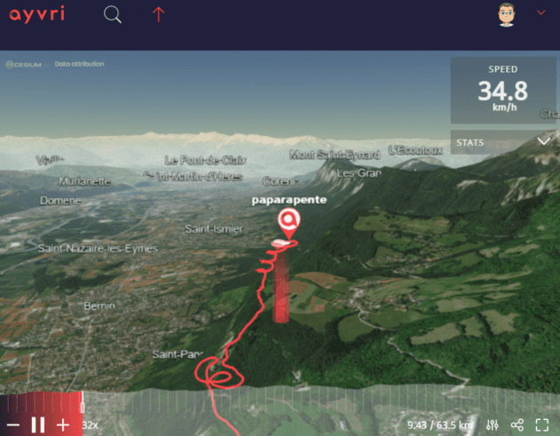
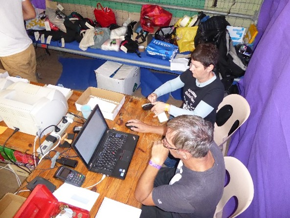
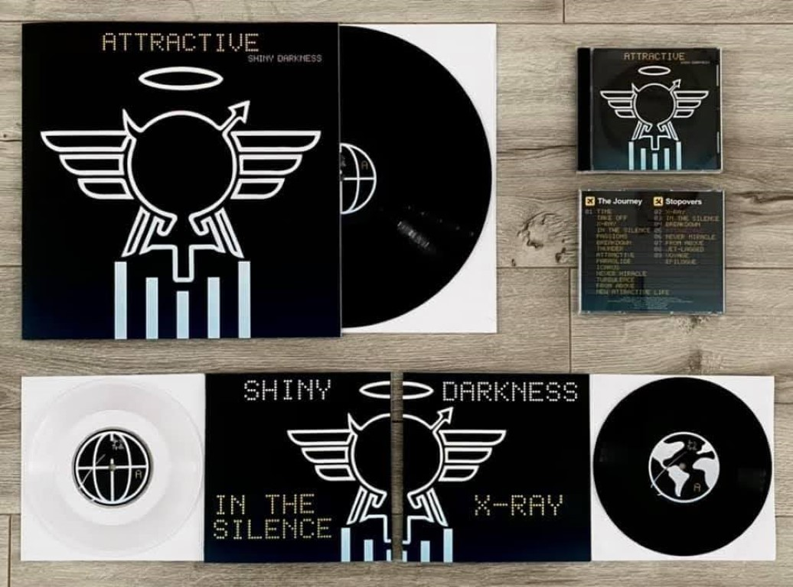
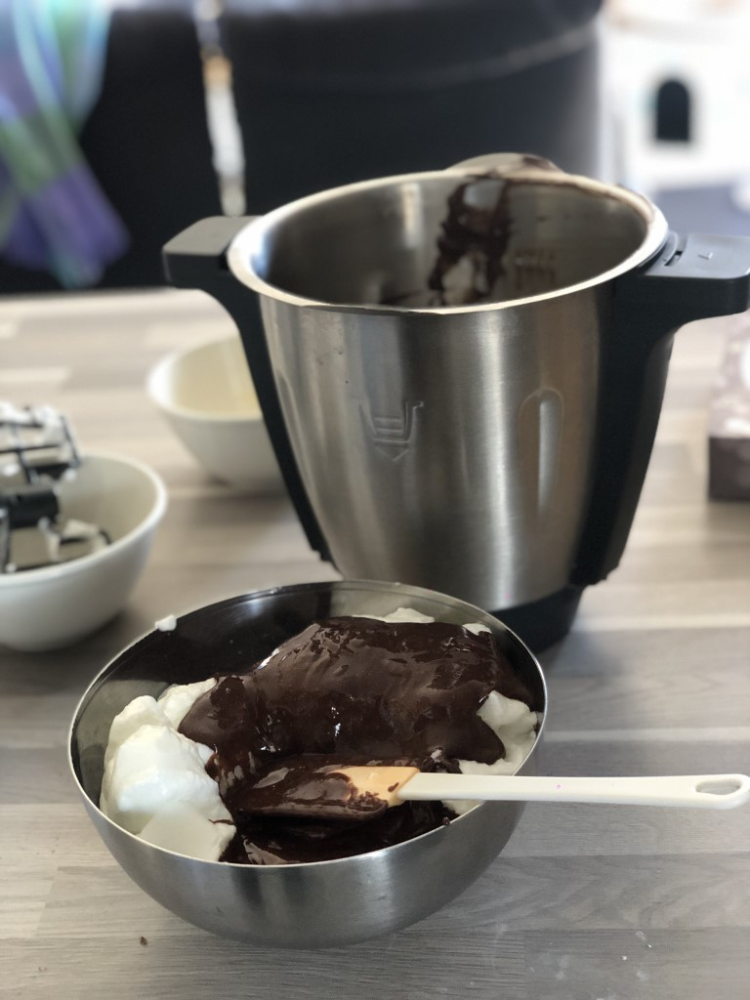

# March 2021

Nights and week-ends in March 2021.  
Inspired by [Ken Corless](https://www.linkedin.com/in/kencorless/) and [Chris Swan](https://blog.thestateofme.com/) "month in review" posts, here is mine.

<!-- more -->

## 🪂 March paragliding flights

I had 2 great paragliding flights in March, with one of them caught on video. Still love the GoPro Hero 9. The fact that it stabilizes horizon makes paragliding videos really smooth. Check it out:

<iframe width="560" height="315" src="https://www.youtube.com/embed/O2s06TPO5YM" title="YouTube video player" frameborder="0" allow="accelerometer; autoplay; clipboard-write; encrypted-media; gyroscope; picture-in-picture" allowfullscreen></iframe>

I have used [Ayvry](https://ayvri.com) previously to visualize the track recorded by my inflight instrument - a GPS from [Syride](https://www.syride.com/), a local manufacturer.

I upload all my flights on their [web site](https://www.syride.com/en/pilotes/paparapente) and turn some of them into interactive Google-earth like experiences, like this: (click on the picture).

The Chartreuse mountain is just beautiful that time of the year, and flight conditions have been great.

## 🎹 Controlling a laser playing along with me

As mentionned in the [February edition](../../2021-02-28/february-2021/) of this "month in review",
another project that I am working on is being able to control a laser from my
[Komplete Kontrol mk2](https://www.native-instruments.com/en/products/komplete/keyboards/komplete-kontrol-s49-s61/) keyboard, while playing live during concerts.
The intent is to be able to set a specific laser figure at the right time (controlled by the timeline),
and then modulate it based on what I play on the keyboard and how I play and leverage
[aftertouch](https://en.wikipedia.org/wiki/Keyboard_expression). In summary, the intent is to control a laser light,
as naturally as the instrument. Easier said than done!

Given that I use Ableton Live during shows for backing tracks and even controlling the other lights,
I wanted to stick with that. The really cool thing about Ableton is that you can create (or reuse) small
filters (à la Linux) which will fulfill a very simple function. For example take the value of the aftertouch
(how I hard I press the key on the keyboard) and use that value as an input for another function.

I eventually came up with this setup:

- [DMX](https://en.wikipedia.org/wiki/DMX512) is a protocol which is mainly used to control lights. I have a small [DMXIS](https://www.dmxis.com/) interface (from USB to DMX with great electrical isolation) I have been using for years to control other lights. My laser has that interface too to control some parameters of the laser (not as flexible as ILDA interface, but good enough for what I want to achieve)
- [OSC](https://en.wikipedia.org/wiki/Open_Sound_Control) is another protocol which aims at replacing the antique MIDI protocol (which I used back in the 90's on my Atari ST!)

Then, chaining several plugins in Ableton ([live grabber for OSC](https://www.showsync.com/tools#livegrabber) and [Expression control +](https://www.maxforlive.com/library/device/5695/expression-control-plus)) makes it possible to achieve my goals.

I don't think it has ever been done, so I'm quite excited to see how far this can go and wow the audience!

## Taking over a PHP app

Every year, I volunteer at "[La Coupe Icare](https://www.coupe-icare.org/GB_home.html)", a beautiful 3 days event for free flight. As part of this engagement, I am part of the team who handles a used gear mini-shop. A PHP was developped some times back. Several bugs and enhancements need to be addressed.

First step was to get the code who has been sitting on a shared Google Drive 😔 in a private GitHub repo, document all issues and convert the documentation from word to markdown.

That's done, and we can now collaborate with other volunteer developers. I know little about php, but enough to fix bugs here and there. Pieces of the app will also move the cloud, as we need to offer a small mobile interface (hello [Flutter](https://flutter.dev/)).

## Creating my own airline

The new Shiny Darkness album - Attractive - is available! Shameless promotion, here is the link to get it: [shinydarkness.com/albums/attractive/](https://shinydarkness.com/albums/attractive/).

For better exposure, I'm working with my son on the next music video. The theme of the album being mostly about travelling, we came up with the idea of creating our own airline. Nothing less 😎
With the new [Flight Simulator 2020](https://www.flightsimulator.com/) being out, I thought I had a way to create my own virtual airline.

Using [Blender](https://www.blender.org/) - an amazing Open Source project - and few tutorials, I was able to come up with videos which look pretty amazing.

## Chocolate mousse and Iles flottantes

I'm not a great chief, but I enjoy deserts. I got myself a great cooking assistant last year, the [Monsieur Cuisine Connect](https://www.monsieur-cuisine.com/en/).

Iles flottantes (also known as "Oeufs à la neige") is one of my (and wife and kids) favorite recipe. It's a vanilla cream with egg whites and caramel.

The Mousse au chocolat is another personal favorite, which I can customize to my own taste (less sugar, blend of dark and milk chocolate).

## To be continued

Thanks for reading this far! April will be different with more time spent at home, because of a stricter lock-down here in France. 👋 be safe.
