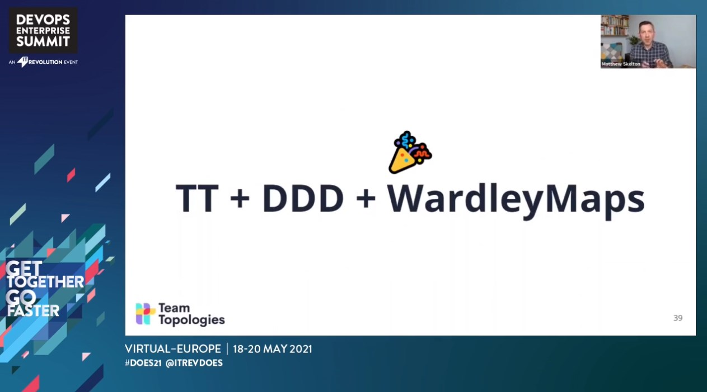

# 10 talks from Virtual DevOps Enterprise Summit Europe 2021

10 great talks - with videos and slides - which I would not want you to miss from DevOps Enterprise Summit conference 2021. Last minute ⌚: I added 2 bonus sections (reading list and links).

<!-- more -->

I attended the DevOps Enterprise Summit Europe on May 18-20th, 2021, by IT Revolution, [Gene Kim](https://twitter.com/RealGeneKim) and the programming committee. I did not attend all the sessions live, but as videos were released on the fly, I was able to catch up every day on the sessions I wanted to watch.

Here are 10 talks which I recommend to watch, for free, at [videolibrary.doesvirtual.com](https://videolibrary.doesvirtual.com/). Don't miss getting the slides (link below the videos) as video can sometime be a bit blurry.

## 1. Fast and Slow integrated problem solving structures

A brilliant talk where [Dr Steven Spear](https://twitter.com/StevenJSpear) and [Gene Kim](https://twitter.com/RealGeneKim) share the virtual stage and their thoughts on organizing for different types of problem solving structures. A great link between the best seller book - [Thinking, Fast and Slow](https://en.wikipedia.org/wiki/Thinking,_Fast_and_Slow) - and DevOps / knowledge workers.

## 2. Information Flow Cultures

[Dr Ron Westrum](https://en.wikipedia.org/wiki/Ron_Westrum) is well known for his paper on "[typology of organisation cultures](https://www.ncbi.nlm.nih.gov/pmc/articles/PMC1765804/)" which describes pathological, bureaucratic and generative types of culture.

This talk brings a number of great additions on top of the above paper, like Technology Maestro and Cockpit Resource Management,  and goes mid-way with an interview with Gene.

Also, you don't want to miss the two podcasts where Gene and Dr Westrum exchange at length on the above. Those are master pieces.

<iframe title="The Sociology and Typologies of Organizations, and Technical Maestros with Dr. Ron Westrum" allowtransparency="true" height="150" width="100%" style="border: none; min-width: min(100%, 430px);" scrolling="no" data-name="pb-iframe-player" src="https://www.podbean.com/player-v2/?i=j6tt3-1029713-pb&from=embed&share=1&download=1&skin=1&btn-skin=7&size=150"></iframe>

<iframe title="Patterns of Generative Cultures: How They Can Be Destroyed and the Importance of Trust with Dr. Ron Westrum" allowtransparency="true" height="150" width="100%" style="border: none; min-width: min(100%, 430px);" scrolling="no" data-name="pb-iframe-player" src="https://www.podbean.com/player-v2/?i=b4fkw-103f39b-pb&from=embed&share=1&download=1&skin=1&btn-skin=7&size=150"></iframe>

## 3. OK NOTOK OKRs — 3Ms: Mindset, Mission and Measurement

OKRs - as [Jon Smart](https://twitter.com/jonsmart) points out - are rising in popularity. Not that they are new per say, but they are kind of new when applied to Software enabled companies and organizations. A great talk if you want to get started or restarted on OKRs.

## 4. Leadership lessons learned from improving flow in hospital using theory of constraints

Forget about software for a moment. Here is a great talk, from Dr Strear - emergency physician - which technology leaders can leverage as they look at transforming their teams, their organization. Dr Strear is also the coauthor of a book - [Smash the Bottleneck](https://www.smashthebottleneck.com/).

## 5. Build Internal Capability, Not Consultant Dependency

I was looking forward for this talk, and I was not disappointed. As a consultant myself in my current role, I believe it is truly important to commit for the best business outcomes for the customer.

[Courtney Kissler](https://twitter.com/chawklady) and [Suzette Johnson](https://twitter.com/drsuz_johnson) provide great advices in achieving that goal and achieve mutual benefits.

## 6. DevOps Confession

I do not remember at which DevOps Enterprise Summit where "DevOps Confessions" was introduced (2018?). But since then, this has been a session which I never missed. Don't miss this one. Also thinking that a confession format could be used for other topics.

## 7. You suck at cloud and it's not all your fault

[Corey Quinn](https://twitter.com/QuinnyPig) is well known in tech (especially cloud / AWS) for his newsletter - [Last week in AWS](https://www.lastweekinaws.com/), his [tweets](https://twitter.com/QuinnyPig), and also very engaging presentations.

This talk is again technically informative (if you leverage cloud (not just AWS)) and really fun and engaging to watch.

## 8. Patterns/Anti Patterns in team topologies

Following the great book [Team Topologies](https://teamtopologies.com/book) by [Matthew Skelton](https://twitter.com/matthewpskelton) and [Manuel Pais](https://twitter.com/manupaisable) on Team Topologies, this is a talk sharing patterns and anti patterns on those topologies.

## 9. DevOps: approaching cruising altitude

The (continued) DevOps journey of American Airlines by Maya Leibman, EVP and CIO and [Ross Clanton, managing director](https://twitter.com/RossClanton) and how DevOps helped them achieve amazing changes during the pandemic.

## 10. A layered approach to progressive delivery

I consider Progressive Delivery the next level after continuous delivery. You want to look at progressive delivery, even if you have not achieve continuous deployment as it will help get you there and derisk deployment.

## 11. 🤨

"Wait! You told me 10 videos."

Yes, I know, and frankly all talks have been really good. Just in case you want more, here are few additional talks I watched and  enjoyed:

- [DevOps for enterprise applications](https://videolibrary.doesvirtual.com/?video=549298721)
- [DevOps for SFDC](https://videolibrary.doesvirtual.com/?video=549298140)
- [P&G DevOps Journey](https://videolibrary.doesvirtual.com/?video=551641782)
- [Adidas: from heavy change management process to KPI driven GO/NO-GO](https://videolibrary.doesvirtual.com/?video=550704056)
- [The business benefits of GitOps](https://videolibrary.doesvirtual.com/?video=549298638)

## Bonus: reading list

Several attendees furiously collected books mentioned throughout the talks and made a list. 

## Before you go...

The same people also collected links. Here they are:

- [Example of Problem Solving – Japanese Men’s Relay Team Rio 2016](https://www.allaboutlean.com/japan-relay-2016/)
- [teamtopologies.com/infographics](https://teamtopologies.com/infographics), [academy.teamtopologies.com/](https://academy.teamtopologies.com/), [github.com/TeamTopologies/ drawio library](https://github.com/TeamTopologies/Team-Shape-Templates#drawio--diagramsnet)
- [Efficiency is the Ennemy](https://fs.blog/2021/05/slack/)
- [Interview with Admiral John Richardson and Steve Spear](https://itrevolution.com/the-idealcast-episode-15/)
- [Success criteria and types of Key Results - Felipe Castro](https://felipecastro.com/en/okr/success-criteria-types-key-results/)
- [martinfowler.com/articles/data-mesh-principles.html](https://martinfowler.com/articles/data-mesh-principles.html)
- [Tech Debt Burndown Podcast](https://techdebtburndown.com/)
- [www.learningfromincidents.io/](https://www.learningfromincidents.io/)
- [itrevolution.com/forum-paper-downloads/](https://itrevolution.com/forum-paper-downloads/)
- [itrevolution.com/book-excerpts-and-resources/](https://itrevolution.com/book-excerpts-and-resources/)
- [www.profound-deming.com/work-1/blog-brief-history-of-quality-control](https://www.profound-deming.com/work-1/blog-brief-history-of-quality-control)
- [gds.blog.gov.uk/2020/05/13/how-government-as-a-platform-is-helping-in-the-covid-19-response/](https://gds.blog.gov.uk/2020/05/13/how-government-as-a-platform-is-helping-in-the-covid-19-response/)
- [For the serious history buffs, you can read all about GDS’s History here](https://gds.blog.gov.uk/story/)
- [Service Standard - Service Manual - GOV.UK](https://www.gov.uk/service-manual/service-standard)
- [Government Digital Service - both how we did it and most of the code](https://gds.blog.gov.uk/)
- [en.wikipedia.org/wiki/United_Airlines_Flight_232#cite_note-CVR_Transcript-10](https://en.wikipedia.org/wiki/United_Airlines_Flight_232#cite_note-CVR_Transcript-10)
- [itrevolution.com/lack-of-psychological-safety-at-boeing/](https://itrevolution.com/lack-of-psychological-safety-at-boeing/)
- [Crew Resource Management (CRM)](https://en.wikipedia.org/wiki/Crew_resource_management)
- [The Whitehall Study](https://unhealthywork.org/classic-studies/the-whitehall-study/)
- [State of software supply chain report 2020](https://www.sonatype.com/resources/white-paper-state-of-the-software-supply-chain-2020)
- John Willis current Blog: https://www.profound-deming.com/
- [The Myth of Productivity vs Compliance: How To Have It All (Stephen Magill, Ph.D. & Gene Kim)](https://www.dropbox.com/s/nk6625d84oajgug/Gene%20%26%20Stephen%20DOES%20Draft%20gk-sm-3.pptx?dl=0)
- [www.gitops.tech/](https://www.gitops.tech/)
- [AMA with Jon Smart](https://www.youtube.com/watch?v=TAj0Do3bNAM)
- [Software BoMs](https://advisory.kpmg.us/blog/2020/what-are-sboms.html)
- [Remove the Barriers - Jason Cox](https://www.jasonacox.com/wordpress/archives/876)
- [gbr.pepperdine.edu/2017/08/the-garden-an-organismic-metaphor-for-distinguishing-inclusion-from-diversity/](https://gbr.pepperdine.edu/2017/08/the-garden-an-organismic-metaphor-for-distinguishing-inclusion-from-diversity/)

## But why?

This long blog post acts as a collection of bookmarks for me. Hopefully it is useful for you too.

Thanks for reading, and follow me on [twitter](https://twitter.com/ojacques2) for more.
