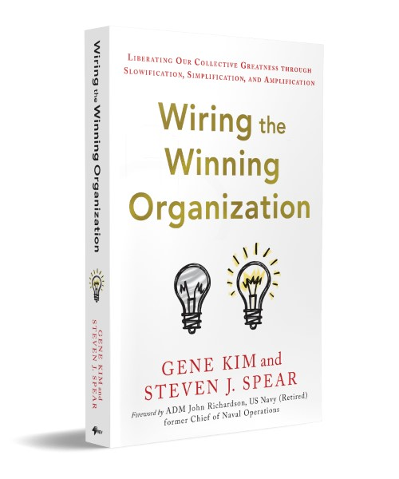
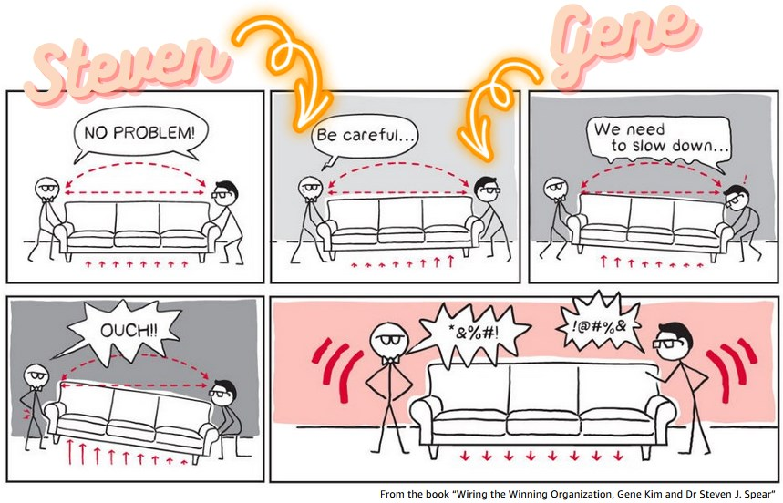
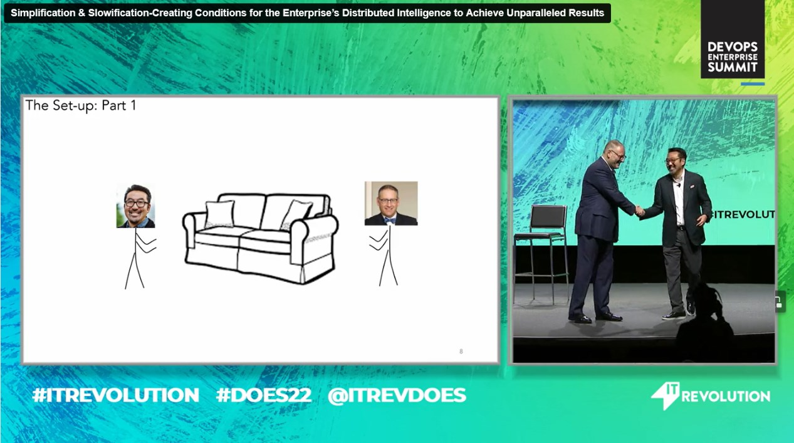

# 💡 Wiring the Winning Organization - Book Review

The new book from Gene Kim and Steven J. Spear "[Wiring the Winning
organization](https://itrevolution.com/product/wiring-the-winning-organization/){:target="_blank"}" is out. I was privileged to get
an early copy, so that I can give my honest opinion. Here it is: it's not for everyone, but an absolute must read for senior leaders
who want to understand the difference between a winning organization and a losing one, and do something about it.

<!-- more -->

## The authors - Gene Kim and Dr Steven J. Spear

[Gene Kim](https://twitter.com/RealGeneKim){:target="_blank"} is a reknown book author in the IT industry. "[The Phoenix
Project](https://itrevolution.com/book/the-phoenix-project/){:target="_blank"}" (more than a million copies since 2013, and a book I bought many
copies for my customers as discussion starters), "[The DevOps
handbook](https://itrevolution.com/product/the-devops-handbook-second-edition/){:target="_blank"} ", and later "[The Unicorn
Project](https://itrevolution.com/the-unicorn-project/){:target="_blank"} " have been instrumental in the DevOps movement, and shaped the way we think
about IT and business.

Gene Kim did not wrote the book alone. He is joined by [Dr Steven J. Spear](https://twitter.com/stevenjspear){:target="_blank"} , who shared the stage
many times with Gene during the DevOps Enterprise Summit conferences. It really is work were Gene and Steven brought their own
expertise and experience (itself inspired by a lot of earlier material), inspired each other, to eventually come up with a simple
theory which makes sense.

{:target="_blank"} {:target="_blank"}

Where the audience for "The Phoenix Project" was IT Operations, software developers for "The Unicorn Project", "Wiring the
Winning Organization" (WWO) is for the most senior leaders in an organization.

Let's dive in. 🤿

## Conclusion first

Let's go straight to the conclusion. "Wiring the Winning Organization" will give you keys to understand why some organizations are
winning, and others are not. The book provides a theory with a set of 3 mechanisms leaders can use to "wire" the organization:
Slowification, Simplification and Amplification.

This book gave me the reading companion I was missing to connect many concepts I had learned over the years, from Lean, Agile,
DevOps, Amazon mechanisms and two pizza teams, Toyota Production System, Resilience Engineering, Developer Experience, and many
more. It also gave me a mental model to structure my thinking about organizations, pinpoint issues, and propose solutions based on
the theory and the many case studies presented in the book.

I would still insist that it is not for everyone: developers, IT operations, and even middle managers who are busy getting work done in a broken organization won't find much value in this book. In case you are one of them, buy the book and put it on the desk of your VP or SVP. If you are one of those senior leaders, the book can help you having meaningful conversations, and help you too connect the dots between Lean, Agile, DevOps and other practices which may or may not have made a difference for you.

## The book

After a rather long intro on organizational performance, the book provides a theory - well, 3 theories really: Slowification,
Simplification and Amplification (SSA). Each theory is followed by case studies from not only the tech sector (Amazon, Google), but also
from manufacturing (Toyota), healthcare, and even the military (US Navy).

In addition to SSA, the book introduces the concept of "layers" in an organization, and how they interact with each other. The layers are "Technical objects" (objects that people work on), "Tools and Instrumentation" (which we use to work on layer 1 objects), and "Social Circuitry" (processes, procedures, norms and routines: the human layer that overlays the technical layers).

How do you assess where you are? This is where the notions of "Winning Zone" and "Danger Zone" come into play. Gene and Steven will give you clues to determine in which zone your organization maybe, and how to move it to the "winning zone".

The book is illustrated too, with classics such as [Venn diagrams](https://en.wikipedia.org/wiki/Venn_diagram){:target="_blank"}, but also with comics where we could easily recognize Gene Kim and Dr Steven J. Spear. 😁

## Where do you get started?

Interested? Let's see how you can get started. It's interesting to see that nowadays, the book is not the only medium to get into
the theory, learn from the use cases and get your organization in the winning zone.

- You can [buy the book](https://itrevolution.com/product/wiring-the-winning-organization/){:target="_blank"}, and read it. Start to
  finish. I got it on Kindle, and I am glad I did. I can highlight, and easily go back to the highlights (all my highlights are
  retrieved in my [Obsidian notebook](https://obsidian.md/){:target="_blank"}). I can also search for keywords, and find the
  relevant sections.
- You can [get the reader's guide](https://itrevolution.com/product/readers-guide-wiring-the-winning-organization/){:target="_blank"} with a summary for the 
- Start with a [large, watermarked excerpt](https://itrevolution.com/wp-content/uploads/2023/02/Pages-from-WWO_Excerpt_Watermarked.pdf){:target="_blank"} to give you a good taste of the book
- Watch the recording of Gene and Steven's talk at [DevOps Enterprise Summit 2022](https://videos.itrevolution.com/watch/763825118/){:target="_blank"} (don't miss [part 2](https://videos.itrevolution.com/watch/779257338/){:target="_blank"})

